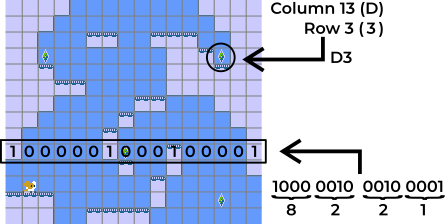

# Animalia Dreamland


A brand new game for the Nintendo Entertainment System
that fits on just two 8-kibibyte ROM chips.

## Table of Contents
* [Building](#building)
* [Playing](#playing)
* [Modding](#modding)

## Building

The [cc65 suite][1] is required to assemble and link the sources.
The Makefile was written for [BSD-compatible make][2];
on a GNU system, you'll want to search for a `bmake` package
in your package manager.
GNU's `make` is not supported, and will result in build errors.

Once the tools are installed, building is as simple as running
```sh
bmake
```

## Playing

The game is verified to work on real hardware
and therefore should be compatible with any emulator.
You might enjoy using any of the following:

* [Mesen][3] (preferred)
* [Nestopia UE][4]
* [Nintaco][5] (requires a Java runtime)

## Modding
There is no fully-featured level editor for this game,
but level layouts can be edited with a hex editor.
A level file is precisely 33 bytes long,
the first 28 of which are a compact 16x14 bitmap of the ground.
Each pair of two bytes within this range is a single row of tiles,
where the first byte represents the left half of the screen
and the second the right half.
The most-significant bit refers to the leftmost tile of the half,
and less significant bits proceed rightward.
There is ground anywhere there is a 1 bit, and air in the 0 bits.

After this bitmap, there are five single-byte coordinate pairs
whose upper four bits represent the column (0x–Fx left-to-right)
and whose lower four bits represent a row (x0–xD top-to-bottom).
The first coordinate pair is the player's spawn location,
and the other four are the crystals that the player must collect.



Level names are stored in `src/levels.asm` directly after
the inclusion of their associated data.
A level name must be precisely 15 bytes,
and should be padded with spaces in order to be centered
with this region, biased to the right.

Music is similarly lacking an editor.
The various songs in the `src/songs` directory
might be reasonable starting points for modification,
but essentially there are notes, and commands:
* 00–4F: notes as defined in `src/songs/notes.inc`, followed by a duration in frames (60ths of a second)
* 7F: `rest`, silence, followed by a duration in frames (60ths of a second)
* F9: `CMD_SHAPE`, set the first register of the instrument, followed by a single-byte parameter
* FA: `CMD_DECAY_OFF`, turn off decay
* FB: `CMD_DECAY_ON`, turn on decay
* FC: `CMD_SUSTAIN_OFF`, turn off Constant Volume mode
* FD: `CMD_SUSTAIN_ON`, turn on Constant Volume mode
* FE: `CMD_JUMP`, jump, followed by a sixteen-bit little-endian address
* FF: `CMD_STOP`, stop playing

The decay, sustain, and shape commands control APU registers directly.
See the [NESDev wiki][6] for more details.


[1]: https://github.com/cc65/cc65
[2]: http://www.crufty.net/help/sjg/bmake.htm
[3]: https://www.mesen.ca/
[4]: http://0ldsk00l.ca/nestopia/
[5]: https://nintaco.com/
[6]: https://www.nesdev.org/wiki/APU
